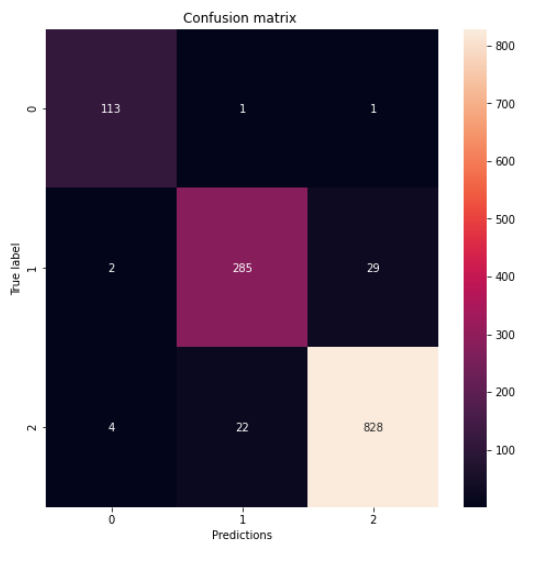

# COVID-RESNET

**IMPORTANT NOTE**:  The model provided here was created by personal research and is not ready to be used in production, it should not be used for the clinical diagnosis of COVID-19, the diagnosis must be given by a competent doctor.

COVID-RESNET is a personal project which seeks to build a neural network model based on a residual neural network (resnet) for the detection of COVID19 in chest x-rays.
 

	
	 
	<em>Chest X-rays for the three classes: COVID19, Normal and Pneumonia.</em>

## Table of contents

1. [Requirements](#REQUIREMENTS) to run the code.
2. [COVID-DATASET](DATA/DATA.md) the Dataset that was used to train and test the model
3. [Results](#RESULTS) Results in the test set
4. [Links for weights of the trained model](https://drive.google.com/drive/folders/1Zg6NKX15Oa5PFdbBpY_1sZhOja0otzQG?usp=sharing)
5. [authors](#AUTHORS)

Requirements
=============
- Code tested with Tensorflow 2.3  and  Tensorflow 2.4
- Keras 2.4 (included in the Tensorflow core)
- Python 3.8
- Numpy
- Scikit-learn
- Seaborn
- Matplotlib
- Jupyter
- pydot
- pydotplus
- Graphviz

Results
=============

These are the final results for the **COVID-RESNET** model in the test set:
 

	
	 
	<em>Confusion Matrix in test set.</em>

 

<table class="tg">
  <tr>
    <th class="tg-7btt" colspan="3">Presicion(%)</th>
  </tr>
  <tr>
    <td class="tg-7btt">COVID-19</td>
    <td class="tg-7btt">Normal</td>
    <td class="tg-7btt">Pneumonia</td>
  </tr>
  <tr>
    <td class="tg-c3ow">95.0</td>
    <td class="tg-c3ow">93.0</td>
    <td class="tg-c3ow">97.0</td>
  </tr>
</table>

<table class="tg">
  <tr>
    <th class="tg-7btt" colspan="3">Sensitivity or Recall(%)</th>
  </tr>
  <tr>
    <td class="tg-7btt">COVID-19</td>
    <td class="tg-7btt">Normal</td>
    <td class="tg-7btt">Pneumonia</td>
  </tr>
  <tr>
    <td class="tg-c3ow">98.0</td>
    <td class="tg-c3ow">90.0</td>
    <td class="tg-c3ow">97.0</td>
  </tr>
</table>

<table class="tg">
  <tr>
    <th class="tg-7btt" colspan="3">F1-score</th>
  </tr>
  <tr>
    <td class="tg-7btt">COVID-19</td>
    <td class="tg-7btt">Normal</td>
    <td class="tg-7btt">Pneumonia</td>
  </tr>
  <tr>
    <td class="tg-c3ow">0.97</td>
    <td class="tg-c3ow">0.91</td>
    <td class="tg-c3ow">0.97</td>
  </tr>
</table>

Authors
=============
* Samuel Cueva Lozano - [samuelcueva](https://github.com/samuelcueva)

